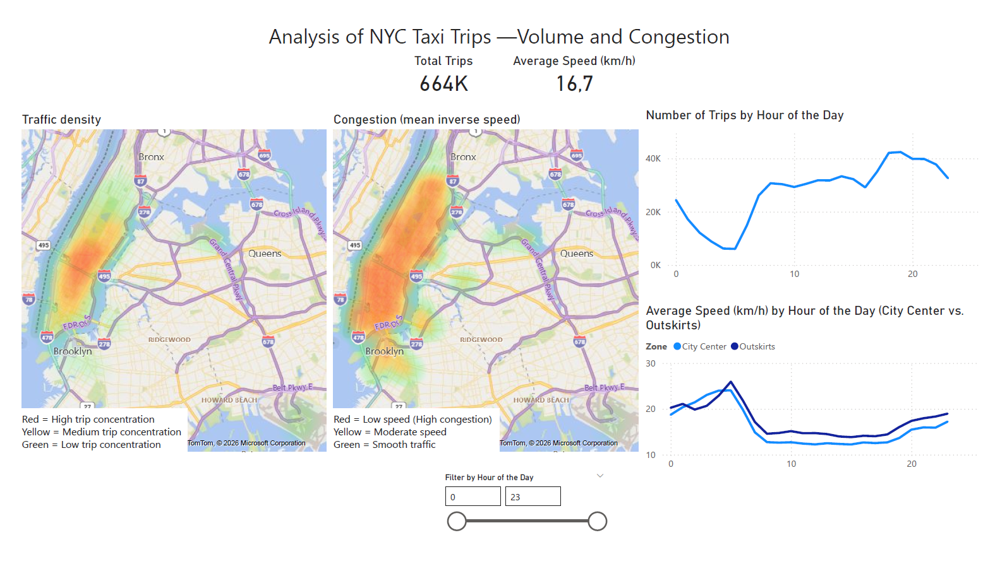

# NYC Taxi SQL Project

## Overview
This project analyzes New York City taxi trips to identify traffic patterns, demand peaks, and congestion dynamics across time and space.

## Dataset
- **Source:** Kaggle - *New York City Taxi Trip Duration*
- **Main variables used:** pickup and dropoff timestamps, pickup and dropoff coordinates, passenger count, trip duration

## Tools
- PostgreSQL
- pgAdmin
- SQL
- Power BI

## Workflow
1. Import the raw CSV dataset into PostgreSQL.
2. Build a cleaned working table by removing unrealistic rows:
   - trip duration <= 0
   - trip duration >= 7200 seconds
   - passenger count outside 1-6
   - missing pickup or dropoff coordinates
3. Run exploratory SQL analysis on temporal, behavioral, and geographic patterns.
4. Estimate trip distance with the Haversine formula and derive average speed.
5. Build a Power BI dashboard to visualize trip density, estimated congestion, and hourly behavior.

## Key business questions

### 1) When are the peak activity periods?
Trip activity is highest in the evening, especially between **18:00 and 22:00**. The strongest peaks appear on **Thursday and Friday evenings**, with additional strong activity on **Saturday night**.

### 2) Which days have the most trips?
Trip volume is higher toward the end of the week, especially on **Thursday, Friday, and Saturday**.

### 3) What is the average trip duration?
The average trip duration is about **14 minutes**.

### 4) Does passenger count affect behavior?
Most trips are made with **one passenger**, and these trips are also slightly shorter on average than trips with more passengers.

### 5) Are there anomalies in the data?
Trips with estimated speeds above **120 km/h** were treated as likely data errors. Trips below **5 km/h** were rare and treated as anomalies for speed-based analysis, while common low speed trips were considered valid and attributed to congestion.

### 6) Do trips differ between weekdays and weekends?
There are slightly more trips on weekdays (550.17 vs 544.46 per day on average), and the average trip duration is also longer. Estimated average speed is about **14.43 km/h on weekdays** versus **16.13 km/h on weekends**, suggesting smoother traffic on weekends. This indicates that traffic patterns are strongly influenced by daily work-related commuting.

### 7) Is congestion mainly geographic or temporal?
The dashboard shows that trip density is highest in central Manhattan, but the gap in average speed between center and periphery is relatively small overall. The strongest congestion signal appears **by hour of day**, especially during rush periods, rather than as a purely spatial difference.

## Methodological note on speed
Trip distance was estimated using the **Haversine formula**, which measures straight-line distance between pickup and dropoff points. Because taxis do not travel in straight lines, the resulting speed is an **approximate indicator** rather than a true road-speed measurement. It is still useful for comparing zones and time periods.

## Dashboard

The Power BI dashboard includes:
- **Total trips** KPI
- **Average speed** KPI
- A heatmap of **trip density**
- A heatmap of **estimated congestion** (inverse speed is used to better capture low-speed areas, which are otherwise smoothed out when averaging spatial data)
- A line chart of **trip count by hour**
- A line chart comparing **center vs periphery speed by hour**

## Main takeaway
Taxi demand is highly concentrated in central Manhattan, but congestion is best understood as a **time-dependent phenomenon**. The center is only slightly slower on average than the periphery, while hourly analysis shows clearer slowdowns during peak demand periods.
